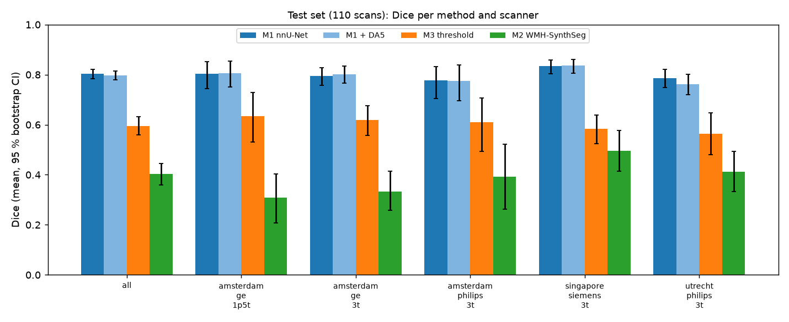
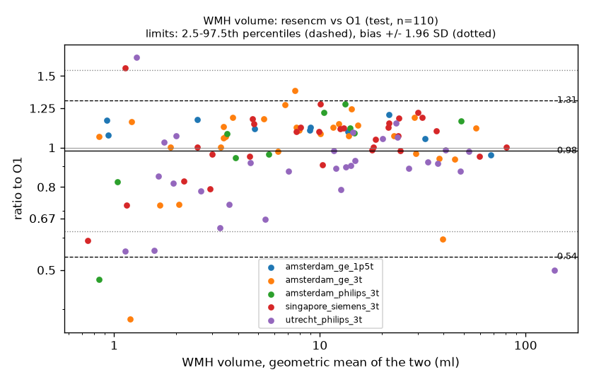
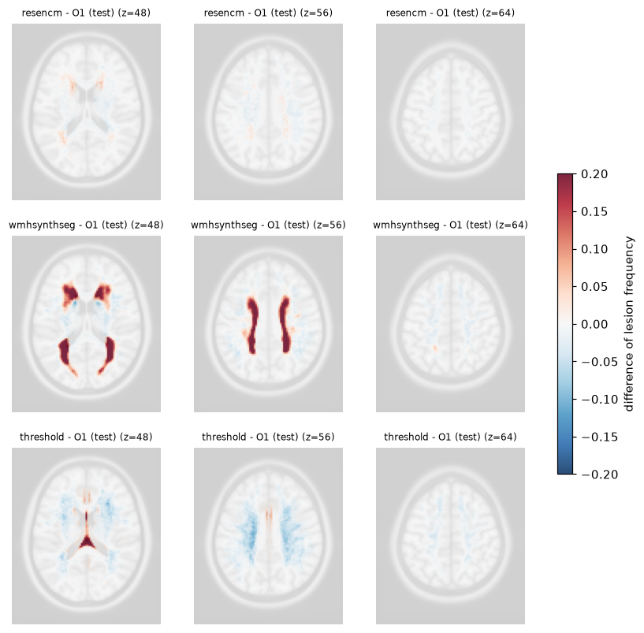

# wmh-multisite

[](https://github.com/JeanBrrt/wmh-multisite/actions/workflows/ci.yml)

**Chaîne reproductible d'analyse multicentrique des hyperintensités de la substance blanche (HSB) en IRM** : des images brutes aux biomarqueurs, avec contrôle qualité, segmentation, évaluation statistique et harmonisation inter-sites.

Les données proviennent du challenge MICCAI WMH 2017 (170 IRM FLAIR + T1 issues de **5 scanners** sur 3 sites différents).

Ce projet s'articule autour de quatre questions :

> **Question.** Quand les images viennent de centres, d'appareils et de protocoles différents, peut-on
> (1) repérer les images problématiques, (2) segmenter les lésions de façon fiable, y compris sur un scanner jamais vu,
> (3) en tirer des biomarqueurs comparables d'un site à l'autre, et (4) retirer l'empreinte du scanner sans effacer la biologie ?

Chaque choix est justifié, avec ses alternatives et ses preuves, dans le journal de décisions [`justification.md`](justification.md) (J-001 à J-066). L'avancement est suivi dans [`ROADMAP.md`](ROADMAP.md).

---

## Résultats en bref

| | Résultat |
|---|---|
| **Segmentation** | nnU-Net (ResEnc M) : **Dice 0,80** sur 110 cas de test, **9e sur 58** au classement officiel (2e au Dice, 1er sur l'erreur de volume) |
| **Plafond humain** | Deux experts indépendants s'accordent à Dice 0,76 ; nnU-Net atteint 0,815 contre la référence sur les mêmes cas |
| **Scanners inconnus** | Aucune dégradation démontrée (Dice −0,015, IC 95 % [−0,066 ; +0,030], 20 cas de 2 scanners jamais vus) |
| **Biomarqueur** | Volume de HSB : ICC 0,982 avec la référence, **au niveau de deux experts** (0,981 et 0,977) ; un biais de site subsiste, experts compris |
| **Harmonisation** | Le scanner est deviné à 90 % à partir de la substance blanche saine, 73 % après normalisation, **28 % après ComBat** (hasard 20 %), sans perte du signal biologique |
| **Contrôle qualité** | Champ de biais détecté avant qu'il ne nuise à la segmentation ; **le mouvement dégrade la segmentation dès le plus faible niveau sans être détecté en FLAIR** (limite principale) |

---

## Données

- **MICCAI WMH Segmentation Challenge 2017** (Kuijf et al., *IEEE TMI* 2019), [doi:10.34894/AECRSD](https://doi.org/10.34894/AECRSD), licence **CC BY-NC 4.0**. Les données ne sont **pas** versionnées et sont téléchargées par l'API DataverseNL (1 551 fichiers, 4,1 Go, empreintes SHA-1 vérifiées).
- 60 sujets d'entraînement (3 scanners) et 110 de test, dont **20 issus de 2 scanners absents de l'entraînement** (généralisation hors domaine prévue par le challenge).
- Labellisation manuelle d'un expert (O1, relue par un second, O2) ainsi que de deux autres experts (O3, O4) sur les 60 cas d'entraînement, ce qui permet de calculer un plafond humain.

| Centre | Scanner | Champ | Entraînement | Test | FLAIR acquise | T1 acquise |
|---|---|---|---|---|---|---|
| UMC Utrecht | Philips Achieva | 3 T | 20 | 30 | 2D axiale, 0,96 × 0,95 × 3 mm | 3D sagittale, 1 × 1 × 1 mm |
| NUHS Singapour | Siemens TrioTim | 3 T | 20 | 30 | 2D axiale, 1 × 1 × 3 mm | 3D sagittale, 1 × 1 × 1 mm |
| VU Amsterdam | GE Signa HDxt | 3 T | 20 | 30 | 3D sagittale, 0,98 × 0,98 × 1,2 mm | 3D sagittale, 0,94 × 0,94 × 1 mm |
| VU Amsterdam | Philips Ingenuity | 3 T | 0 | 10 | 3D sagittale, 1,04 × 1,04 × 0,56 mm | 3D sagittale, 0,87 × 0,87 × 1 mm |
| VU Amsterdam | GE Signa HDxt | 1,5 T | 0 | 10 | 3D sagittale, 1,21 × 1,21 × 1,3 mm | 3D sagittale, 0,98 × 0,98 × 1,5 mm |
| **Total** | | | **60** | **110** | | |

Les organisateurs fournissent toutes les FLAIR **reconstruites en coupes axiales de 3 mm** (grilles de 128 × 256 × 103 à 321 × 240 × 83 voxels selon le scanner), et défacées pour Amsterdam seulement. La FLAIR est l'image de référence : la vérité terrain et l'évaluation sont dans sa grille.

---

## La chaîne de traitement

```
DataverseNL ─> BIDS ─> recalage rigide T1→FLAIR ─> masque du cerveau (HD-BET) ─> correction de biais N4
                                                                                        │
         ┌──────────────────────────────────────────────────────────────────────────────┤
         v                                    v                                          v
  contrôle qualité               segmentation : M1 nnU-Net,                   normalisation d'intensité
  (indicateurs MRIQC,            M2 WMH-SynthSeg, M3 seuillage                (z-score, WhiteStripe,
   atypiques par site)                       │                                 appariement d'histogrammes)
                                             v                                          │
                              évaluation officielle + statistiques                      v
                                             │                               signature de site, ComBat
                                             v
                          biomarqueurs (volume / ICV, périventriculaire / profond,
                          nombre de lésions, cartes MNI), accord par site
```

### 1. Données et prétraitement

Les données sont téléchargées via l'API Dataverse et converties au format **BIDS 1.10**. Les organisateurs fournissent un prétraitement des images brutes basé sur un recalage **elastix** et une correction du champ de biais par **SPM12**. Le prétraitement est refait autrement ici : la T1 est recalée sur la FLAIR par un recalage rigide (**ANTs**, information mutuelle comme critère) et le champ de biais est corrigé par **N4**, estimé dans un masque du cerveau produit par **HD-BET** (sur GPU local).

Les deux recalages sont équivalents à une fraction de voxel près ([tableau A1](#a1)) (corrélation médiane 0,998, écart médian 0,14 mm). Nos champs de biais ressemblent à ceux de SPM12 ([tableau A2](#a2)) (corrélation 0,74 à 0,98). Notre prétraitement n'apporte pas de gain de performance ([tableau A5](#a5), [tableau A7](#a7)) mais plutôt de la traçabilité depuis les données brutes.

Pour les cartes de groupe, chaque sujet est recalé sur le modèle **MNI152** par un recalage non linéaire **SyN**. La corrélation croisée remplace l'information mutuelle comme critère, elle est plus gourmande en calcul mais indispensable pour suivre les **ventricules dilatés** des sujets atrophiés. Le réglage par défaut ne les ramènait pas dans le contour du modèle (volume ventriculaire estimé 86 ml sur un sujet atrophié avec CC contre 26 ml avec le réglage par défaut). Le calcul sur le modèle à 2 mm divise le temps par 8 (6 min au lieu de 50 par sujet) pour une qualité presque identique.

### 2. Contrôle qualité

Les indicateurs de qualité (SNR, SNR de Dietrich, CNR, CJV, EFC, FBER, étendue du champ de biais) sont calculés en se basant sur les définitions de **MRIQC**. Comme dans MRIQC, le bruit et le contraste sont mesurés sur l'image **corrigée par N4** (sur l'image brute, ils compteraient le biais une seconde fois), et le biais est mesuré à part, **sur le champ N4** lui-même. MRIQC ne prend pas en charge la FLAIR, et on réalise les adaptations suivantes par rapport à l'original :

- Les masques des régions anatomiques nécessaires au calcul des indicateurs de qualité sont extraite de la segmentation de WMH-SynthSeg. La substance blanche est érodée d'un voxel sur son contour pour éviter l'effet de volume partiel et les HSB en sont retirées, ainsi qu'une marge de 2 mm autour d'elles (la substance blanche qui borde une lésion est souvent déjà anormale, et faisait dépendre le SNR de la charge lésionnelle). Le masque de substance grise n'est composé que du cortex, trop fin (2 à 3 mm) pour être érodé comme la substance blanche.
- Les calculs sont effectués sur l'intersection avec le masque du cerveau HD-BET. C'est avant tout une sécurité, puisque les régions de WMH-SynthSeg ne débordent quasiment pas de ce masque (sur 20 sujets : 0 % de la substance blanche et 0,3 % du cortex en médiane ne sont pas dans l'intersection du masque de cerveau).
- Le masque de l'air est le complément de la tête (seuil d'Otsu, plus grande composante, trous remplis, puis dilatation), en excluant les zéros exacts (placés par le scanner ou par le défacement des sujets).
- Le CJV et le rapport SB/SG ne sont jugés que sur la T1, parce que  en FLAIR la substance blanche et la substance grise ont presque la même intensité (rapport de 0,87 à 0,99), ce qui ferait exploser le CJV sans rapport avec la qualité.
- La T1 est mesurée sur sa grille d'origine (le rééchantillonnage lisserait le bruit).

Un z-score robuste est calculé **par scanner** pour chaque indicateur, avec la médiane et la MAD plutôt que la moyenne et l'écart type, sensibles aux anomalies. Le plus grand de ces z-scores donne un classement **utilisable / à vérifier / à exclure** (z ≥ 3 : à vérifier ; z ≥ 5 : à exclure, recommandation de contrôle visuel, jamais automatique). Une Isolation Forest signale en plus comme « à vérifier » les images dont la combinaison de z-scores est la plus atypique, même si aucun indicateur n'est extrême à lui seul.

**Résultat : ([tableau A3](#a3))**

Sur les 110 cas de test (on ne peut pas faire cette analyse sur les cas d'entraînement, car le modèle M1 a appris dessus) on obtient 90 utilisables et 20 signalés (15 à vérifier, 5 à exclure). Les deux groupes ont un Dice comparable avec M1 (moyenne de 0,817 contre 0,799, médiane de 0,828 contre 0,823) et le test de Mann-Whitney pour des groupes indépendants donne p = 0,54. Le score d'anomalie continu que produit l'Isolation Forest n'a qu'une corrélation de Spearman faible avec le Dice (−0,19, p = 0,051, à la limite de la significativité).

Les images que le contrôle qualité a relevées comme les plus atypiques pour leur scanner ne sont donc pas pénalisées lors de la segmentation. Deux raisons principales : les organisateurs ont présélectionné des images de qualité, et nnU-Net (M1) encaisse bien ces variations. De plus, l'indicateur le plus souvent signalé par notre contrôle qualité est l'étendue du champ de biais qui est justement corrigé par N4 avant la segmentation.

----------------------- 

Nos données sont donc « propres ». Pour être sûr que notre contrôle qualité détecte des données réellement « sales », on crée un sous-ensemble de données artificiellement dégradées par des artefacts d'intensité croissante (via TorchIO : bruit, champ de biais, images fantômes, mouvement). On regarde ensuite la part des images détectées et l'effet des mêmes artefacts sur la segmentation par M1, ce qui compte ce sont les images **non détectées par notre contrôle qualité ET dont la segmentation se dégrade**.

**Résultats ([tableau A4](#a4)) :**

- **Champ de biais :** Le contrôle qualité le signale dès le niveau 2 (60 %, puis 100 %) alors que la Dice de M1 ne décroche qu'au niveau 3 (0,68, puis 0,44 au niveau 4).
- **Bruit :** détection partielle (30 à 70 %) pour une dégradation progressive et modérée du Dice (0,78 à 0,70).
- **Images fantômes :** La Dice baisse aux niveaux 3 et 4 (0,73 puis 0,64) mais la détection n'atteint 60 % qu'au niveau 4.
- **Mouvement :** Il dégrade la segmentation dès le plus faible niveau (Dice 0,79 → 0,74, rappel lésionnel 0,72 → 0,53 : les petites lésions floutées disparaissent) et il n'est pas détecté en FLAIR. Il l'est en partie sur la T1 de la même séance (50 à 70 %) où les indicateurs de MRIQC conçus pour la T1 sont plus sensibles.

C'est la principale limite de notre contrôle qualité. Les indicateurs de MRIQC qui visent le flou et les artefacts dans l'air (FWHM, QI1) n'ont pas été repris pour simplifier ce projet. Le principal axe d'amélioration du contrôle qualité est donc l'implémentation de métriques plus spécifique au mouvement et images fantômes.

### 3. Segmentation

Trois méthodes sont comparées dans ce projet :

| | Méthode | Rôle |
|---|---|---|
| **M1** | **nnU-Net v2, ResEnc M**, 3d_fullres, FLAIR + T1 ; entraîné sur Kaggle (2 × T4, 250 epochs, ~10,5 h) sur le pli 0 de 5 plis stratifiés par scanner et par charge lésionnelle (48 cas d'entraînement, 12 de validation) | Méthode principale |
| M2 | **WMH-SynthSeg** (FreeSurfer), modèle publié, utilisé sans modification (CPU, ~6 min et 26 à 30 Go de RAM par sujet) | Modèle généraliste prêt à l'emploi |
| M3 | Seuillage de la FLAIR : z-score robuste dans le cerveau (seuil 2,2), profondeur minimale (14 mm du bord du cerveau) et taille minimale (40 mm³), réglés par recherche sur grille (1 674 combinaisons) sur l'entraînement | Référence classique |

Avec quelques variantes :
- **M1 avec augmentation forte** (DA5, même budget) : aucun gain y compris sur les scanners inconnus (Dice 0,798 contre 0,802, p Holm = 1) ;
- **M1 sur le prétraitement des organisateurs** : même Dice (0,803) ;
- **M3 par scanner** : le seuil optimal varie de 1,7 (Singapour) à 2,6 (Utrecht), signe de la dépendance d'une règle d'intensité au scanner ; il n'est donné qu'à titre d'information, un seul seuil global est utilisé ;
- **M3 avec 4 normalisations d'intensité** : voir Harmonisation.

### 4. Évaluation

**Protocole.** Toutes les méthodes sont évaluées sur les **110 cas de test** jamais utilisés pour entraîner ni régler quoi que ce soit, contre la référence O1. On utilise le script **officiel** du challenge, copié sans modification, pour que les chiffres soient directement comparables au classement. Les zones « autre pathologie » (label 2) sont ignorées. Cinq métriques complémentaires sont calculées pour chaque sujet :
- **Dice** : recouvrement des voxels
- **HD95** : distance (mm) entre les contours au 95e centile, sensible aux erreurs éloignées 
- **AVD** : erreur relative sur le volume total 
- **rappel lésionnel** et **F1 lésionnel** : détection lésion par lésion (composantes 26-connexes) où chaque lésion compte pour 1 quelle que soit sa taille.

**Méthodes statistiques.**
- **Incertitude** : intervalle de confiance à 95 % de chaque moyenne par **bootstrap percentile stratifié par scanner** (2 000 tirages avec remise, stratifiés par scanner pour conserver la composition du test).
- **Comparaison de deux méthodes** : **appariement** sur les mêmes sujets puis différence sujet par sujet, intervalle de confiance bootstrap de la différence moyenne, **test de Wilcoxon** signé (sans hypothèse de normalité) et **correction de Holm** sur les 140 tests (8 variantes évaluées, 28 paires, 5 métriques) pour contrôler les faux positifs dus à la multiplicité des tests.
- **Scanners connus contre inconnus** : deux groupes de patients différents (90 et 20) donc **non appariés**. Différence des moyennes avec un bootstrap de chaque groupe et **test de Mann-Whitney**.
- **Plafond humain** : les experts O3 et O4 sont notés contre O1 avec les mêmes métriques. Les 12 cas de validation du fold 0 sont les seuls où M1 (qui ne les a pas vus) et les experts sont jugés sur les mêmes images.
- **Classement** : formule officielle du challenge (chaque métrique ramenée entre 0 pour la meilleure équipe et 1 pour la pire, puis moyenne des 5 rangs) chaque méthode étant insérée seule parmi les 57 équipes publiées.

**Résultats clés.**
- **M1 atteint la 9e place sur 58** ([tableau A5](#a5)). Il est 2e au Dice et 1er à l'AVD, mais seulement 22e au rappel lésionnel (0,73) : son point faible est la détection des petites lésions. M3 (0,595) et M2 (0,402) sont 55e.
- **M1 surpasse M3 et M2 sur les 5 métriques** (p Holm < 1e-9, [tableau A7](#a7)). M3 et M2 ne se dominent pas : M3 a le meilleur recouvrement et le meilleur volume, M2 trouve plus de lésions mais sur-segmente (AVD de 293 %).
- **Ni l'augmentation forte (DA5) ni le prétraitement des organisateurs ne changent le résultat de M1** (différences de Dice de +0,005 et −0,001, p Holm = 1, [tableau A7](#a7)).
- **M1 est stable d'un scanner à l'autre** : Dice de 0,776 (Amsterdam Philips) à 0,834 (Singapour) ([tableau A6](#a6)).
- **M1 ne se dégrade pas de façon démontrée sur les 2 scanners jamais vus à l'entraînement.** Son Dice est de 0,790 sur les 20 cas de ces scanners contre 0,805 sur les 90 cas des scanners vus, une différence de −0,015 avec un intervalle de confiance [−0,066 ; +0,030] et un p = 0,45 ([tableau A8](#a8)). Les autres méthodes (M2, M3 et les variantes) ne montrent pas non plus d'écart significatif entre scanners vus et inconnus. Cependant avec seulement 20 cas l'intervalle est large et une petite perte ne peut pas être exclue.
- **M1 est au niveau des experts** : sur les 12 cas partagés, Dice de 0,815 contre 0,757 et 0,781 pour O3 et O4 ([tableau A9](#a9)) et deux experts indépendants ne s'accordent qu'à 0,74 à 0,76. Ce n'est pas forcément « mieux qu'un expert » puisque M1 a pu apprendre le style de labelisation de O1 contre lequel il est jugé.

### 5. Biomarqueurs

L'évaluation (section 4) juge la segmentation voxel par voxel mais une étude clinique utilise **un chiffre par patient** i.e. un biomarqueurs. Il faut alors également analyser statistiquement la fiabilité de ces valeurs. 

On calcule les biomarqueurs suivant pour chaque sujet et chaque source de segmentation (O1, M1, M2, M3 ; O3 et O4 sur l'entraînement) après retrait des zones « autre pathologie » (label 2) :
- **volume de HSB** : en utilisant le volume exacte d'un voxel qui varie de 1,75 à 4,72 mm³ selon le scanner
- **% du volume intracrânien** :  ICV tiré de la segmentation de WMH-SynthSeg 
- **volumes périventriculaire et profond** : un voxel de HSB est périventriculaire s'il est à 10 mm ou moins des ventricules latéraux (segmentés par WMH-SynthSeg)
- **nombre de lésions** : composantes 26-connexes (comme le script officiel) d'au moins 10 mm³ pour que le compte soit comparable entre résolutions
- **cartes de fréquence lésionnelle** : dans l'espace MNI par site et par source.

**Protocole d'accord.** Chaque source est comparée à O1 : M1, M2 et M3 sur les 110 cas de test, les experts O3 et O4 sur les 60 cas d'entraînement, qui donnent la **référence humaine**. Pour chaque sujet, on calcule **d = ln(source / O1)**. 

**Méthodes statistiques.**
- **Bland-Altman**, la méthode de référence pour comparer deux mesures d'une même grandeur : le **biais** (moyenne des d ramenée en rapport par une exponentielle) dit si la source mesure trop ou trop peu en moyenne et les **limites d'accord** encadrent l'erreur sur 95 % des patients pris un par un. La formule classique (biais ± 1,96 écart type) suppose des d de loi normale, donc symétriques mais ce n'est pas le cas ici (pour M1, asymétrie −1,4, test de Shapiro-Wilk p < 0,001). On utilise donc les **limites empiriques** (2,5e et 97,5e centiles des d), avec leur intervalle de confiance par bootstrap stratifié par scanner.
- **ICC d'accord absolu** (ICC(A,1), McGraw et Wong) sur le logarithme des volumes, avec un IC bootstrap stratifié par scanner : la part de la variabilité due aux vraies différences entre patients plutôt qu'aux erreurs de mesure (1 = accord parfait). Contrairement à une corrélation, il pénalise un écart systématique (une méthode qui doublerait tous les volumes aurait une corrélation de 1).
- **Biais par site** : biais de chaque scanner avec son IC bootstrap et un test de Wilcoxon contre 0, corrigés par Holm sur les 116 tests ; puis un **test de Kruskal-Wallis** pour savoir si le biais diffère d'un scanner à l'autre.
- **Cartes MNI** : chaque masque est transporté dans l'espace commun (FLAIR → T1 → MNI), puis on calcule la proportion de sujets ayant une lésion en chaque voxel. L'accord avec O1 est la **corrélation de Pearson voxel à voxel** entre les cartes (même motif spatial = 1), complétée par des cartes de différence qui montrent où se situent les écarts.

**Résultats clés.**
- **M1 mesure le volume aussi bien qu'un second expert** : rapport moyen 0,98, limites d'accord [0,54 ; 1,31], ICC 0,982, contre 0,97 [0,61 ; 1,47] et 0,981 pour O3, et 0,91 [0,57 ; 1,61] et 0,977 pour O4 ([tableau A11](#a11)). Son erreur est **asymétrique** : il surestime rarement de plus de 30 %, mais sous-estime fortement quelques patients (jusqu'à −46 %), ceux chez qui il manque beaucoup de petites lésions. Les limites restent larges même entre experts : pour un patient donné, un second expert peut donner de 0,6 à 1,6 fois le volume de O1. C'est la marge réaliste de mesure d'un volume de HSB.
- **M3 est juste en moyenne mais imprécis par patient** (1,18 [0,38 ; 6,14], ICC 0,81) ; **M2 surestime d'un facteur 2,4** (ICC 0,37) et n'est pas utilisable comme biomarqueur sur ce protocole ([tableau A11](#a11)).
- **Les lésions profondes sont moins bien mesurées** que les périventriculaires : M1 les sous-estime de 13 % (0,87 [0,31 ; 1,40], ICC 0,964, contre 1,00 [0,54 ; 1,32] et 0,982). Les experts aussi (0,86 et 0,78) : O1 annote plus de lésions profondes que les autres ([tableau A11](#a11)).
- **Nombre de lésions** : M1 en compte environ 18 % de moins que O1 (ICC 0,89), au niveau des experts (0,85 et 0,88) ; M3, qui élimine les petites lésions, est à 0,31 ([tableau A11](#a11)).
- **Le biais dépend du site pour M1, M3 et les deux experts** (Kruskal-Wallis p < 0,001), mais pas pour M2 (p = 0,10), dont la surestimation est forte mais uniforme. M1 sous-estime d'environ 13 % à Utrecht (0,87 [0,80 ; 0,95]) et surestime d'environ 10 % sur GE 1,5T (1,10 [1,06 ; 1,14]) ; ces écarts ne restent pas significatifs après la correction de Holm (p = 0,08 et 0,27). Les experts ont aussi des biais de site : O4 sous-estime de 20 % à Singapour (p Holm = 0,003) ([tableau A12](#a12)). Une partie du « biais de site » d'une méthode reflète donc le style de la référence sur certains sites, et, sans données démographiques, un biais associé au site peut venir de la population autant que du scanner.
- **Les lésions sont placées aux bons endroits** : la carte de M1 corrèle à 0,995 avec celle de O1 (0,97 à 0,99 par site), contre 0,90 pour M3 et 0,88 pour M2 (0,67 sur GE 1,5T). Les cartes de différence montrent que l'excès de M2 se concentre dans un liseré le long des ventricules, et que M3 fait des faux positifs sur la ligne médiane ([tableau A13](#a13)).

### 6. Harmonisation

**Normalisation d'intensité**, testée par son effet sur le seuillage, site par site : sans normalisation, le seuillage s'effondre (Dice 0,203, 0,00 sur 2 scanners) ; les trois normalisations par image suppriment l'effet du site, et la plus simple, le z-score robuste, est la meilleure (0,595) ([tableau A14](#a14)).

**Signature de site et ComBat** : 20 caractéristiques de la substance blanche saine (FLAIR et T1), **classifieur de site** en validation croisée (5 plis), **ComBat** (neuroHarmonize) appris dans les plis d'entraînement, avec la charge lésionnelle et l'ICV comme covariables protégées.

Le scanner est deviné à 90 % sans normalisation, 73 % après z-score et **28 % après ComBat** (hasard 20 %), et la variance due au site passe de 71 % à 2 % ([tableau A15](#a15)). La normalisation par image ne retire qu'une partie de l'empreinte du scanner ; ComBat l'efface presque entièrement, et le lien avec la biologie ressort même un peu mieux.

### 7. Reproductibilité

**Snakemake** (chaîne complète, étapes Kaggle décrites comme externes), environnement verrouillé (**uv**), **155 tests** pytest sur données synthétiques, **GitHub Actions** (lint, tests, construction de l'image Docker), **Docker** et **Apptainer**, script **SLURM** pour Jean Zay (5 plis en parallèle, non testé).

**Coût de calcul** : environ **5,5 kWh et 2,3 kg CO₂eq** au total, dont 98 % pour les calculs sur Kaggle (deux entraînements nnU-Net de ~10 h sur 2 × T4, WMH-SynthSeg sur CPU) ; mesuré avec **CodeCarbon** pour les étapes locales, estimé pour les autres ([`carbon_footprint.csv`](results/tables/carbon_footprint.csv)).

---

## Reproduire

```bash
uv sync --extra local                                    # environnement verrouillé (Python 3.12)
uv run python -m wmh_multisite.data.download             # ~4 Go depuis DataverseNL, SHA-1 vérifiés
uv run snakemake -s workflow/Snakefile --cores 4         # toute la chaîne locale
```

- Deux étapes tournent sur **Kaggle** (GPU / RAM insuffisants en local) : l'entraînement nnU-Net ([`kaggle/03_nnunet_train.ipynb`](kaggle/03_nnunet_train.ipynb)) et WMH-SynthSeg ([`kaggle/05_wmhsynthseg.ipynb`](kaggle/05_wmhsynthseg.ipynb)). Le workflow les décrit comme des étapes externes et indique quoi lancer si leurs sorties manquent.
- **Conteneurs** : `docker build -f containers/Dockerfile -t wmh-multisite .` (image CPU, construite à chaque push par l'intégration continue) ; [`containers/apptainer.def`](containers/apptainer.def) pour le calcul intensif.
- **Jean Zay** : [`hpc/slurm_jeanzay.sh`](hpc/slurm_jeanzay.sh) entraîne les 5 plis en parallèle (**non testé**, faute d'accès).
- Tests : `uv run pytest` (155 tests, données synthétiques, sans réseau).

---

## Outils

| Domaine | Outils |
|---|---|
| Imagerie | nibabel, SimpleITK, ANTsPy (N4, recalages rigide et SyN), HD-BET, TemplateFlow (MNI152NLin2009cAsym), BIDS |
| Segmentation | nnU-Net v2 (ResEnc M), WMH-SynthSeg (FreeSurfer), PyTorch |
| QC | indicateurs de type MRIQC, scikit-learn (Isolation Forest), TorchIO (artefacts simulés) |
| Statistiques | NumPy, SciPy, pandas (bootstrap, Wilcoxon, Mann-Whitney, Holm, ICC, Bland-Altman) |
| Harmonisation | neuroHarmonize / neuroCombat (ComBat), scikit-learn |
| Reproductibilité | uv, Snakemake, pytest, ruff, GitHub Actions, Docker, Apptainer, SLURM, CodeCarbon, nbstripout |
| Calcul | GPU local (RTX 4060 laptop, sous watchdog mémoire), Kaggle (2 × T4) |

## Organisation du dépôt

```
config/config.yaml          tous les paramètres (chemins, seuils, grilles, graines)
src/wmh_multisite/
  data/                     téléchargement DataverseNL, conversion BIDS
  preproc/                  recalage, masque du cerveau, N4, atlas
  qc/                       indicateurs, atypiques, artefacts simulés, robustesse
  seg/                      export et inférence nnU-Net, seuillage
  evaluate/                 script officiel, métriques, statistiques, plafond humain, classement
  biomarkers/               volumes, localisation, lésions, accord, cartes MNI
  harmonize/                normalisations, caractéristiques, ComBat
  viz/                      figures, rapport QC
workflow/Snakefile          chaîne complète
kaggle/                     notebooks des étapes sur GPU distant
notebooks/                  explorations et contrôles visuels (sorties retirées)
containers/, hpc/           Docker, Apptainer, SLURM
tests/                      155 tests
results/tables, figures     résultats agrégés (aucune image de patient)
justification.md            journal des décisions (J-001 à J-066)
```

## Limites

- **Un seul pli** d'entraînement nnU-Net, sans ensemble (budget GPU) ; le script SLURM prévoit les 5 plis.
- **20 cas** de scanners inconnus, tous d'Amsterdam : « aucune dégradation démontrée » ne veut pas dire « aucune dégradation ».
- Aucune donnée démographique : un écart entre sites peut venir de la population autant que du scanner ; le signal biologique protégé par ComBat est la charge lésionnelle elle-même.
- Le **mouvement** n'est pas détecté par le QC en FLAIR, alors qu'il dégrade la segmentation dès un faible niveau.
- N4 atténue un peu le contraste des lésions chez les sujets à très forte charge (pistes : exclure les lésions du masque de N4).
- Plafond humain mesuré sur 12 cas, de scanners vus.

## Références

- Kuijf H.J. et al. *Standardized Assessment of Automatic Segmentation of White Matter Hyperintensities and Results of the WMH Segmentation Challenge.* IEEE TMI, 2019.
- Isensee F. et al. *nnU-Net: a self-configuring method for deep learning-based biomedical image segmentation.* Nature Methods, 2021 ; *nnU-Net Revisited.* MICCAI, 2024.
- Laso P. et al. *Quantifying white matter hyperintensity and brain volumes in heterogeneous clinical and low-field portable MRI* (WMH-SynthSeg). ISBI, 2024.
- Isensee F. et al. *Automated brain extraction of multisequence MRI using artificial neural networks* (HD-BET). Human Brain Mapping, 2019.
- Tustison N.J. et al. *N4ITK: improved N3 bias correction.* IEEE TMI, 2010.
- Esteban O. et al. *MRIQC.* PLoS ONE, 2017.
- Johnson W.E. et al. *Adjusting batch effects in microarray expression data using empirical Bayes methods* (ComBat). Biostatistics, 2007 ; Pomponio R. et al. *Harmonization of large MRI datasets* (neuroHarmonize). NeuroImage, 2020.

## Licence

Code sous licence MIT ([`LICENSE`](LICENSE)). Les données du challenge restent sous licence CC BY-NC 4.0 et ne sont pas redistribuées.

---

## Annexes : tableaux de résultats

<a id="a1"></a>
### A1. Recalage rigide ANTs contre elastix (169 sujets recalés par ANTs ; sub-146 utilise la transformation d'elastix, J-039)

| | Corrélation avec elastix | Écart moyen (mm) | Écart maximal (mm) | Rotation relative (°) |
|---|---|---|---|---|
| Médiane | 0,998 | 0,14 | 0,29 | 0,11 |
| Pire cas | 0,974 | 0,69 | 1,36 | 0,75 |
| Médiane, Utrecht Philips 3T | 0,999 | 0,11 | 0,18 | 0,06 |
| Médiane, Singapour Siemens 3T | 0,998 | 0,13 | 0,28 | 0,12 |
| Médiane, Amsterdam GE 3T | 0,994 | 0,21 | 0,45 | 0,17 |
| Médiane, Amsterdam Philips 3T | 0,994 | 0,22 | 0,51 | 0,20 |
| Médiane, Amsterdam GE 1,5T | 0,988 | 0,46 | 0,84 | 0,35 |

<a id="a2"></a>
### A2. Corrélation des champs de biais N4 / SPM12 (médiane, 60 sujets d'entraînement)

| Corrélation SPM12 (médiane, 60 sujets d'entraînement) | Amsterdam GE 3T | Singapour | Utrecht |
|---|---|---|---|
| FLAIR | 0,88 | 0,74 | 0,85 |
| T1 | 0,94 | 0,97 | 0,98 |

<a id="a3"></a>
### A3. Classement du contrôle qualité par scanner (170 sujets)

| Scanner | Utilisable | À vérifier | À exclure |
|---|---|---|---|
| Utrecht Philips 3T | 41 | 5 | 4 |
| Singapour Siemens 3T | 42 | 7 | 1 |
| Amsterdam GE 3T | 45 | 5 | 0 |
| Amsterdam Philips 3T | 7 | 2 | 1 |
| Amsterdam GE 1,5T | 8 | 1 | 1 |
| **Total** | **143** | **20** | **7** |

<a id="a4"></a>
### A4. Artefacts simulés : détection par le contrôle qualité et effet sur nnU-Net, par artefact et par niveau

Détection : part des 10 images classées « à vérifier » ou « à exclure » (2 par scanner, utilisables à l'origine ; seule la modalité indiquée est dégradée). Effet sur la segmentation : moyennes sur 10 autres cas de test utilisables (2 par scanner, dont 4 en commun), FLAIR dégradée, T1 intacte. Artefacts TorchIO, graine fixe.

| Artefact | Niveau | Intensité | Détecté en FLAIR | Détecté en T1 | Dice de M1 | Rappel lésionnel de M1 | AVD de M1 (%) |
|---|---|---|---|---|---|---|---|
| Aucun (image intacte) | 0 | — | 0 % | 0 % | 0,787 | 0,72 | 14,8 |
| **Champ de biais** (coefficients du polynôme) | 1 | 0,1 | 0 % | 10 % | 0,780 | 0,72 | 15,2 |
| | 2 | 0,2 | **60 %** | 50 % | 0,761 | 0,63 | 21,1 |
| | 3 | 0,35 | **100 %** | 100 % | 0,680 | 0,50 | 38,1 |
| | 4 | 0,5 | 100 % | 100 % | **0,442** | 0,34 | 64,8 |
| **Bruit** (écart type / médiane du cerveau) | 1 | 0,03 | 30 % | 10 % | 0,781 | 0,68 | 14,8 |
| | 2 | 0,06 | 50 % | 40 % | 0,766 | 0,60 | 15,1 |
| | 3 | 0,10 | 60 % | 40 % | 0,741 | 0,50 | 17,0 |
| | 4 | 0,15 | 70 % | 80 % | 0,699 | 0,38 | 25,6 |
| **Images fantômes** (intensité des fantômes) | 1 | 0,1 | 20 % | 80 % | 0,784 | 0,71 | 15,5 |
| | 2 | 0,3 | 20 % | 60 % | 0,770 | 0,69 | 15,7 |
| | 3 | 0,6 | 20 % | 60 % | 0,729 | 0,63 | 17,0 |
| | 4 | 1,0 | 60 % | 100 % | 0,637 | 0,48 | 27,6 |
| **Mouvement** (rotation max. en °, translation max. en mm) | 1 | 1 | 20 % | 50 % | **0,736** | **0,53** | 14,8 |
| | 2 | 2 | 20 % | 50 % | 0,699 | 0,44 | 15,8 |
| | 3 | 4 | 20 % | 70 % | 0,595 | 0,34 | 26,8 |
| | 4 | 8 | 20 % | 70 % | 0,591 | 0,31 | 24,9 |

Lecture : le **champ de biais** est détecté (60 % au niveau 2) avant que le Dice ne décroche (niveau 3). Le **bruit** et les **images fantômes** dégradent surtout le rappel lésionnel, avec une détection partielle ou tardive en FLAIR. Le **mouvement** dégrade le Dice et le rappel dès le niveau 1 alors que la détection en FLAIR reste à 20 % à tous les niveaux : les 2 mêmes sujets, déjà proches du seuil, sont signalés quel que soit le niveau (non concluant). Sur la T1, les indicateurs de MRIQC le détectent chez 50 à 70 % des sujets. Le volume (AVD) reste juste plus longtemps que le Dice : les artefacts effacent d'abord les petites lésions, qui pèsent peu dans le volume.

<a id="a5"></a>
### A5. Métriques officielles sur les 110 cas de test (moyenne et IC à 95 %, bootstrap stratifié par scanner) et position au classement

| Méthode (110 cas de test) | Dice ↑ | HD95 (mm) ↓ | AVD (%) ↓ | Rappel lésionnel ↑ | F1 lésionnel ↑ | Classement |
|---|---|---|---|---|---|---|
| **M1 nnU-Net** | **0,802** [0,784-0,820] | **6,1** [4,8-7,7] | **15,4** [13,1-18,0] | **0,728** [0,709-0,746] | 0,783 [0,768-0,798] | **9e / 58** |
| M1 + augmentation forte (DA5) | 0,798 [0,779-0,815] | 6,3 [4,7-8,0] | 16,3 [14,1-18,9] | 0,727 [0,707-0,744] | **0,786** [0,769-0,801] | 10e / 58 |
| M1 sur le prétraitement du challenge | 0,803 [0,783-0,821] | 6,4 [4,9-8,3] | 16,1 [13,3-19,0] | 0,724 [0,703-0,744] | 0,780 [0,762-0,796] | 10e / 58 |
| M3 seuillage | 0,595 [0,558-0,628] | 22,7 [20,9-24,3] | 72,7 [53,0-95,9] | 0,229 [0,210-0,249] | 0,284 [0,267-0,300] | 55e / 58 |
| M2 WMH-SynthSeg | 0,402 [0,361-0,442] | 14,0 [12,6-15,5] | 293 [210-389] | 0,428 [0,399-0,457] | 0,451 [0,432-0,471] | 55e / 58 |

<a id="a6"></a>
### A6. Dice par scanner

| Dice par scanner | Utrecht | Singapour | Ams. GE 3T | Ams. Philips 3T (inconnu) | Ams. GE 1,5T (inconnu) |
|---|---|---|---|---|---|
| M1 nnU-Net | 0,786 | 0,834 | 0,796 | 0,776 | 0,804 |
| M3 seuillage | 0,565 | 0,584 | 0,618 | 0,610 | 0,634 |
| M2 WMH-SynthSeg | 0,413 | 0,495 | 0,333 | 0,392 | 0,309 |



<a id="a7"></a>
### A7. Comparaisons appariées (différence moyenne A − B, Wilcoxon, Holm sur 140 tests ; en gras : p Holm < 1e-9 ; n.s. : p Holm = 1)

| Comparaison (A − B) | Dice | HD95 (mm) | AVD (points) | Rappel | F1 |
|---|---|---|---|---|---|
| M1 − M3 | **+0,208** [0,186 ; 0,232] | **−16,6** | **−57** | **+0,50** | **+0,50** |
| M1 − M2 | **+0,400** [0,372 ; 0,429] | **−7,9** | **−278** | **+0,30** | **+0,33** |
| M3 − M2 | **+0,193** | +8,7 | **−221** | −0,20 | −0,17 |
| M1 − M1 DA5 | +0,005 (n.s.) | −0,1 (n.s.) | −0,9 (n.s.) | +0,002 (n.s.) | −0,003 (n.s.) |
| M1 − M1 prétraitement challenge | −0,001 (n.s.) | −0,3 (n.s.) | −0,7 (n.s.) | +0,005 (n.s.) | +0,003 (n.s.) |

<a id="a8"></a>
### A8. Scanners connus contre inconnus, M1 nnU-Net (Mann-Whitney)

| M1 nnU-Net | Connus (90) | Inconnus (20) | Inconnus − connus [IC 95 %] | p |
|---|---|---|---|---|
| Dice | 0,805 | 0,790 | −0,015 [−0,066 ; +0,030] | 0,45 |
| HD95 (mm) | 5,6 | 8,5 | +2,9 [−2,2 ; +8,7] | 0,96 |
| AVD (%) | 15,6 | 14,4 | −1,2 [−6,3 ; +4,3] | 0,94 |
| Rappel lésionnel | 0,723 | 0,754 | +0,031 [−0,017 ; +0,077] | 0,17 |

<a id="a9"></a>
### A9. Plafond inter-observateurs (12 cas de validation du pli 0, non vus par M1)

| Contre la référence O1 (12 cas) | Dice | HD95 (mm) | Rappel | F1 |
|---|---|---|---|---|
| **M1 nnU-Net** | **0,815** | **4,3** | 0,686 | 0,762 |
| Expert O3 | 0,757 | 5,7 | 0,641 | 0,721 |
| Expert O4 | 0,781 | 4,9 | 0,686 | 0,760 |
| *O4 contre O3 (deux experts indépendants)* | *0,740* | *8,0* | | *0,763* |

<a id="a10"></a>
### A10. Biomarqueurs de la référence O1 par scanner (médianes, 170 sujets)

| Scanner | Volume de HSB (ml) | % de l'ICV | Part périventriculaire | Lésions ≥ 10 mm³ | ICV (ml) |
|---|---|---|---|---|---|
| Utrecht Philips 3T | 13,9 | 0,92 | 0,80 | 47,5 | 1 517 |
| Singapour Siemens 3T | 15,9 | 1,18 | 0,85 | 31,5 | 1 347 |
| Amsterdam GE 3T | 6,3 | 0,44 | 0,87 | 36,5 | 1 465 |
| Amsterdam Philips 3T | 7,6 | 0,57 | 0,84 | 54,0 | 1 445 |
| Amsterdam GE 1,5T | 8,5 | 0,67 | 0,87 | 33,0 | 1 485 |
| **Tous** | **11,2** (0,8 à 195) | | | | **1 450** (1 110 à 1 871) |

<a id="a11"></a>
### A11. Accord des biomarqueurs avec la référence O1 (Bland-Altman sur l'échelle logarithmique, ICC d'accord absolu)

Biais : moyenne des d = ln(source / O1), puis exponentielle (moyenne géométrique des rapports ; 0,98 = 2 % de moins que O1). Limites d'accord : 2,5e et 97,5e centiles des rapports individuels ; elles décrivent la dispersion des patients, ce ne sont **pas** des intervalles de confiance. Entre crochets : intervalle de confiance à 95 % de l'ICC (bootstrap stratifié par scanner). Les sujets sans lésion profonde (ou périventriculaire) sont exclus de ce biomarqueur ; le nombre de lésions est comparé en ln(x + 1). Le % du volume intracrânien donne exactement le même accord que le volume total : pour un patient, la source et O1 sont divisées par le même ICV, donc leur rapport ne change pas.

**Volume total**

| Source | Biais (rapport moyen) | Limites d'accord (95 % des patients) | ICC [IC 95 %] | Biais dépendant du site ? (Kruskal-Wallis) |
|---|---|---|---|---|
| **M1 nnU-Net** (test, 110) | 0,98 | 0,54 à 1,31 | 0,982 [0,975-0,988] | oui (p < 0,001) |
| M3 seuillage (test, 110) | 1,18 | 0,38 à 6,14 | 0,814 [0,740-0,872] | oui (p < 0,001) |
| M2 WMH-SynthSeg (test, 110) | 2,44 | 0,70 à 16,3 | 0,372 [0,281-0,469] | non (p = 0,10) |
| Expert O3 (entraînement, 60) | 0,97 | 0,61 à 1,47 | 0,981 [0,968-0,989] | oui (p < 0,001) |
| Expert O4 (entraînement, 60) | 0,91 | 0,57 à 1,61 | 0,977 [0,965-0,986] | oui (p < 0,001) |

**Volume périventriculaire**

| Source | Biais (rapport moyen) | Limites d'accord (95 % des patients) | ICC [IC 95 %] | Biais dépendant du site ? (Kruskal-Wallis) |
|---|---|---|---|---|
| **M1 nnU-Net** (test, 110) | 1,00 | 0,54 à 1,32 | 0,982 [0,974-0,989] | oui (p = 0,002) |
| M3 seuillage (test, 110) | 1,21 | 0,45 à 4,58 | 0,852 [0,794-0,897] | oui (p < 0,001) |
| M2 WMH-SynthSeg (test, 110) | 2,53 | 0,77 à 14,3 | 0,349 [0,258-0,438] | non (p = 0,09) |
| Expert O3 (entraînement, 60) | 0,98 | 0,61 à 1,49 | 0,980 [0,969-0,988] | oui (p < 0,001) |
| Expert O4 (entraînement, 60) | 0,94 | 0,55 à 1,91 | 0,975 [0,963-0,985] | oui (p < 0,001) |

**Volume profond**

| Source | Biais (rapport moyen) | Limites d'accord (95 % des patients) | ICC [IC 95 %] | Biais dépendant du site ? (Kruskal-Wallis) |
|---|---|---|---|---|
| **M1 nnU-Net** (test, 110) | 0,87 | 0,31 à 1,40 | 0,964 [0,934-0,985] | oui (p < 0,001) |
| M3 seuillage (test, 110) | 0,93 | 0,11 à 37,1 | 0,543 [0,389-0,664] | oui (p < 0,001) |
| M2 WMH-SynthSeg (test, 110) | 2,23 | 0,34 à 61,7 | 0,436 [0,293-0,578] | non (p = 0,22) |
| Expert O3 (entraînement, 60) | 0,86 | 0,31 à 1,45 | 0,969 [0,947-0,986] | oui (p = 0,002) |
| Expert O4 (entraînement, 60) | 0,78 | 0,36 à 1,08 | 0,968 [0,948-0,984] | oui (p < 0,001) |

**Nombre de lésions ≥ 10 mm³**

| Source | Biais (rapport moyen) | Limites d'accord (95 % des patients) | ICC [IC 95 %] | Biais dépendant du site ? (Kruskal-Wallis) |
|---|---|---|---|---|
| **M1 nnU-Net** (test, 110) | 0,82 | 0,58 à 1,16 | 0,890 [0,856-0,917] | oui (p < 0,001) |
| M3 seuillage (test, 110) | 0,55 | 0,25 à 1,67 | 0,305 [0,207-0,392] | non (p = 0,07) |
| M2 WMH-SynthSeg (test, 110) | 0,44 | 0,23 à 1,12 | 0,300 [0,236-0,361] | non (p = 0,58) |
| Expert O3 (entraînement, 60) | 0,79 | 0,48 à 1,15 | 0,847 [0,773-0,898] | oui (p < 0,001) |
| Expert O4 (entraînement, 60) | 0,80 | 0,51 à 1,15 | 0,877 [0,813-0,921] | non (p = 0,21) |



<a id="a12"></a>
### A12. Biais du volume de HSB par scanner : rapport moyen à O1 [IC 95 % bootstrap] ; p de Wilcoxon contre 0 (p de Holm sur 116 tests)

| Scanner | M1 nnU-Net (test) | M3 seuillage (test) | Expert O3 (entraînement) | Expert O4 (entraînement) |
|---|---|---|---|---|
| Utrecht Philips 3T | **0,87** [0,80-0,95] ; 0,001 (0,08) | **1,72** [1,31-2,26] ; < 0,001 (0,008) | 1,13 [1,04-1,25] ; 0,003 (0,23) | 0,96 [0,84-1,10] ; 0,08 (1) |
| Singapour Siemens 3T | 1,03 [0,97-1,10] ; 0,11 (1) | 0,79 [0,65-0,98] ; 0,03 (1) | 0,90 [0,83-0,97] ; 0,007 (0,45) | **0,80** [0,76-0,85] ; < 0,001 (0,003) |
| Amsterdam GE 3T | 1,01 [0,92-1,09] ; 0,05 (1) | 1,28 [1,11-1,48] ; 0,007 (0,43) | 0,89 [0,79-0,99] ; 0,07 (1) | 1,00 [0,91-1,09] ; 0,78 (1) |
| Amsterdam Philips 3T (inconnu) | 0,98 [0,81-1,13] ; 0,49 (1) | 1,16 [0,90-1,54] ; 0,49 (1) | — | — |
| Amsterdam GE 1,5T (inconnu) | **1,10** [1,06-1,14] ; 0,004 (0,27) | 0,96 [0,76-1,22] ; 0,92 (1) | — | — |

Les experts n'ont annoté que les 3 scanners d'entraînement.

<a id="a13"></a>
### A13. Accord des cartes de fréquence lésionnelle (espace MNI, 2 mm) avec la carte de O1 : corrélation de Pearson voxel à voxel (110 cas de test)

| Site | M1 nnU-Net | M3 seuillage | M2 WMH-SynthSeg |
|---|---|---|---|
| **Tous** | **0,995** | 0,903 | 0,879 |
| Utrecht Philips 3T | 0,979 | 0,855 | 0,859 |
| Singapour Siemens 3T | 0,992 | 0,886 | 0,881 |
| Amsterdam GE 3T | 0,987 | 0,887 | 0,816 |
| Amsterdam Philips 3T (inconnu) | 0,969 | 0,848 | 0,796 |
| Amsterdam GE 1,5T (inconnu) | 0,970 | 0,887 | 0,669 |



<a id="a14"></a>
### A14. Normalisation d'intensité : Dice du seuillage et effet du site (Kruskal-Wallis)

| Normalisation de la FLAIR | Dice du seuillage | Effet du site sur le Dice (Kruskal-Wallis) |
|---|---|---|
| Aucune | 0,203 | fort (p < 0,001) ; Dice 0,00 sur 2 scanners |
| **z-score robuste** | **0,595** | aucun (p = 0,90) |
| WhiteStripe | 0,564 | aucun (p = 0,94) |
| Appariement d'histogrammes | 0,522 | aucun (p = 0,52) |

<a id="a15"></a>
### A15. Signature de site des caractéristiques de la substance blanche saine, avant et après ComBat

| Caractéristiques de la substance blanche saine | Scanner deviné (hasard 20 %) | Variance due au site | Lien avec la charge lésionnelle (\|ρ\|) |
|---|---|---|---|
| Sans normalisation | 90 % | 71 % | 0,24 |
| z-score robuste | 73 % | 21 % | 0,40 |
| z-score + **ComBat** | **28 %** | **2 %** | **0,44** |
